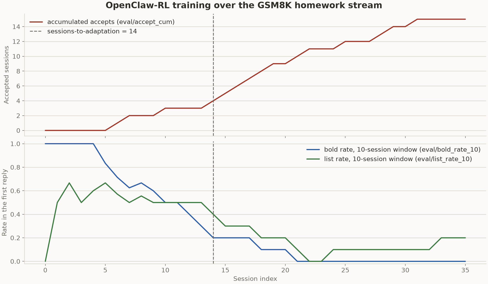
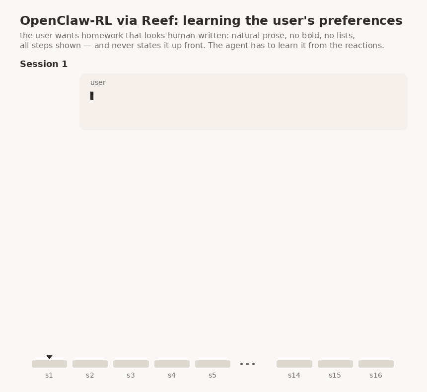

OpenClaw-RL: learn from agent conversations
===========================================

OpenClaw-RL (`arXiv:2603.10165 <https://arxiv.org/abs/2603.10165>`__) trains
a personal agent to satisfy the preferences of its user. It learns from their
conversations: the user's next message shows whether a reply was accepted,
and the model is updated while the agent stays in service.

+-------------+------------------------------------------------------------+
| Evolves     | model weights                                              |
+-------------+------------------------------------------------------------+
| Signal      | none sent by the agent; Reef reads its recorded traffic    |
+-------------+------------------------------------------------------------+
| Loss family | ``openclawrl``                                             |
+-------------+------------------------------------------------------------+
| Package     | ``recipes/openclawrl/``                                    |
+-------------+------------------------------------------------------------+
| Processor   | computed feedback                                          |
+-------------+------------------------------------------------------------+
| Needs       | GPUs, plus a second served model for the PRM judge         |
+-------------+------------------------------------------------------------+
| Example     | ``recipes/openclawrl/examples/openclawrl/``                |
+-------------+------------------------------------------------------------+

What it does
------------

The learning signal comes from the conversation itself: when the user
accepts a reply and moves on, the turn counts as positive, and when the user complains, it counts as
negative. Reef reads this from the traffic it already records, so the agent
does not send training reports. For reliable correlation, the harness should
send a stable ``x-reef-tag-session`` value, unique to the conversation within
its scenario, on every inference in that conversation. Reef stores this opaque
tag with each record and the processor uses it to bind turns in arrival order,
so one tag must not be shared by concurrent or distinct conversations. Without
the tag, the processor falls back to matching the transcripts that clients
resend on later requests.

.. flow::
   :loop: the next session is served by the updated weights

   Traffic :: requests and responses recorded by Reef
   Sessions :: turns correlated by session tag, with trace matching as a fallback
   Judge* :: score each turn from the state that followed it
   Step :: train the policy on judged turns

How Reef implements it
----------------------

The processor rebuilds sessions from the recorded traffic. It prefers the
``x-reef-tag-session`` value supplied by the harness, which also supports
agents that keep or rewrite their history locally. If the tag is absent, a
chat agent must resend an extending transcript so each request can be matched
to its session by trace. Identical histories can be ambiguous, while history
changes that no longer preserve a prefix, such as compaction or sliding
windows, break the chain and leave the pre-rewrite turn unmatched. The
included Hermes example uses a small header shim because Hermes cannot set the
tag itself.

A turn that never correlates is never judged and never trains, so a run on the
fallback can produce an empty training set with nothing else to show for it.
The processor therefore says so: it warns once when it sees untagged traffic,
warns again when sessions keep expiring without ever binding a turn, and counts
both under ``correlation`` in the ``prm_record_file`` line. ``max_open_sessions``
caps the table those unmatched requests fill, evicting the least recently active
sessions above it.

When a session's next state arrives, the finished turn is judged
through an independently deployed PRM. The PRM votes on
whether the message shows acceptance, and on acceptance it also proposes a
hindsight hint, a short instruction that would have produced this reply if
the user had given it up front. Judged turns are batched for training
directly.

OpenClaw-RL trains with two signals, reinforcement learning and on-policy
distillation (OPD). The RL term is a PPO clipped surrogate on the sampled
tokens, with the turn's raw reward as its advantage. The OPD term pulls the policy toward a teacher on the top-K token
candidates the engine recorded at generation time. The teacher is the frozen
base model conditioned on one of the accepted hindsight hints, and the
objective selects which hint by how well the teacher's top-K overlaps the
policy's. The weights of the two terms are ``--openclawrl-w-rl`` and
``--openclawrl-w-opd`` in ``training.options``, both 1.0 by default.

Configuration
-------------

.. config::

   batch_size | 16 | judged turns per training step. Must equal the driver's ``--global-batch-size``.
   session_ttl_s | 900.0 | idle window before a session expires
   max_open_sessions | 4096 | ceiling on live sessions; the least recently active are evicted above it
   prm_url | "" | the PRM's sglang server
   prm_tokenizer_path | "" | required whenever ``prm_url`` is set
   prm_m | 3 | judge votes per turn
   prm_temperature | 0.6 | judge sampling temperature
   prm_max_tokens | 8192 | judge generation budget
   prm_timeout_s | 120.0 | per-judge timeout
   prm_concurrency | 8 | turns judged at once
   prm_max_hint_candidates | 3 | hint candidates collected per turn
   prm_record_file | "" | judged population, one JSON line per batch; empty disables it
   max_staleness | 0 | accepted lag between the producing and serving version. Env ``REEF_MAX_STALENESS``.

The values above are the recipe's defaults. The example's ``serve.yaml``
overrides several of them. It points ``prm_url`` and ``prm_tokenizer_path`` at
the example's independently deployed PRM engine, raises ``prm_timeout_s`` to 3600 because a
thinking model can spend minutes on a single vote, and sets
``prm_record_file`` so every batch leaves one line with the reward split and
the judge counters.

Reef coordinates inference and training only. OpenClawRL's example Compose
file owns PRM and student-model startup, health checks and GPU allocation.
The recipe consumes ``recipe.config.prm-url`` and requires the matching
``recipe.config.prm-tokenizer-path``; it owns judge request handling. Reef does
not register, schedule or stop the PRM process. The student-model endpoint is
used by the simulation harness, outside Reef.

Run the example
---------------

The `example <../../../recipes/openclawrl/examples/openclawrl>`__ reproduces
the paper's personal-agent experiment. A simulated student brings 72 GSM8K
homework problems to a Hermes agent with one session per problem. Each
session is scored on whether the agent's first solution reply satisfies the
student's preferences.

.. code:: bash

   docker build -f docker/Dockerfile.reef -t reef-openclawrl .
   hf download Qwen/Qwen3-4B-Thinking-2507 --local-dir ~/models/Qwen3-4B-Thinking-2507   # policy and PRM
   hf download Qwen/Qwen3-32B --local-dir ~/models/Qwen3-32B                             # the student

   bash recipes/openclawrl/examples/openclawrl/run.sh

``run.sh`` builds the simulated student's image, starts the stack that
``serve.yaml`` describes, and runs the 72 sessions in order. The stack
uses seven GPUs: four for the tensor-parallel actor, one for the rollout
engine, one for the PRM, and one for the Qwen3-32B student model.

Results
-------

The example's README records one run over the first 36 sessions of the stream.

A session passes when the agent's first solution reply already matches the
student's preferences, with the work shown and the correct answer. The
student wants homework that does not look AI-written, so a reply that uses
bold text or a bullet or numbered list draws a complaint. The bold rate and
the list rate measure this habit over the run, as the fraction of the last
ten sessions whose first reply still contains bold text or a list. From the curves we see both fall as
training goes on, and the run reaches the paper's adaptation criterion
(three passed sessions in a row) at session 14.

The demo above replays two sessions from the same run. In session 1 the
student rejects a formatted reply, reef keeps the training going, and by
session 16 the first reply passes directly.

Related guides
--------------

- `Inference and feedback quickstart <../../getting-started/quickstart.rst>`__:
  learn the request, receipt, and report workflow.
- `Train model weights from agent feedback <../evolve-your-model.rst>`__:
  set up the GPU stack and inspect published updates.
- `HTTP API reference <../../reference/http-api.rst>`__: connect your agent
  and query feedback, scenarios, and releases.
