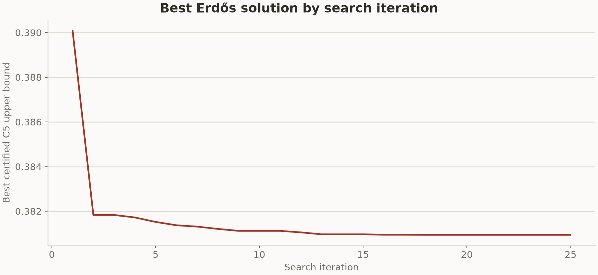

# Erdős result from the formal 8x64 run

This run used the bundled TTT-Discover harness and the Erdős minimum-overlap
judge in this repository. The result below covers the first 25 committed search
and training steps. Each step generated eight groups of 64 programs with
Qwen3-8B. Reef trained a rank-32 LoRA adapter after receiving the complete grid
and served the updated adapter during the next step.

## Result

The verifier minimizes the certified `C₅` upper bound. The reward used for
training and PUCT search is `1 / (1e-8 + C₅)`.

| Steps shown | Certified result | TTT-Discover | Target |
| ---: | ---: | ---: | ---: |
| 25 | `0.38094` | `0.38093` | `0.38080` |

Table 2 of the TTT-Discover paper reports `0.38093` for Qwen3-8B on the same
task. The two values come from separate search trajectories. The target comes
from the task instruction and is not a proven optimum.

## Best solution by iteration

The curve uses the committed PUCT archive after each of the first 25 steps.
Lower values are better.

## Run configuration

| Setting | Value |
| --- | --- |
| Model | `Qwen/Qwen3-8B`, thinking enabled |
| Hardware | `2 x NVIDIA B200` |
| Search grid | 8 groups x 64 rollouts |
| Steps shown | 25 |
| Maximum new tokens | 26,000 |
| Sequence length | 30,000 |
| Sampling | temperature 1.0, top-p 1.0 |
| Optimizer | Adam, learning rate `4e-5` |
| Adapter | LoRA rank 32, alpha 32 |
| Evaluation limit | 1,000-second program budget |

The run continued across scheduler allocations with the same scenario,
checkpoint, and PUCT archive.

## Run records

W&B stored the training metrics under run
[`f0b3542e6f07f20ad681bd3643182196`](https://wandb.ai/weianxie-massachusetts-institute-of-technology/reef/runs/f0b3542e6f07f20ad681bd3643182196).
The stored state contains one search trajectory, so this result does not
estimate variance across seeds.

## Stored files

- `summary.csv` contains the result and W&B run ID.
