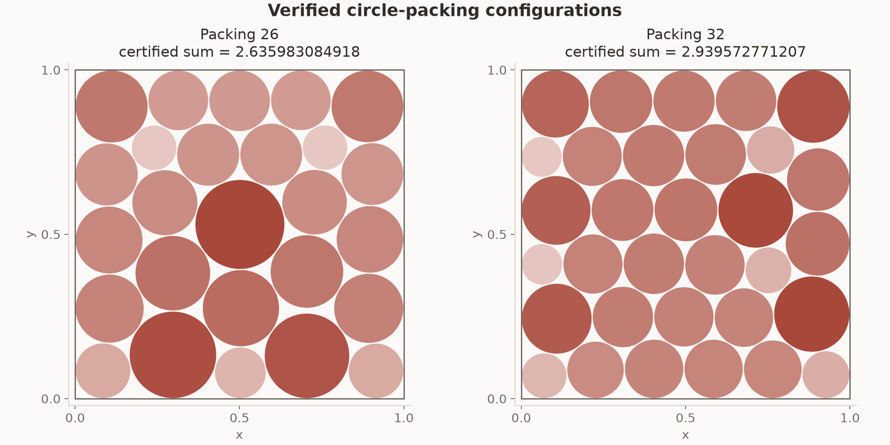
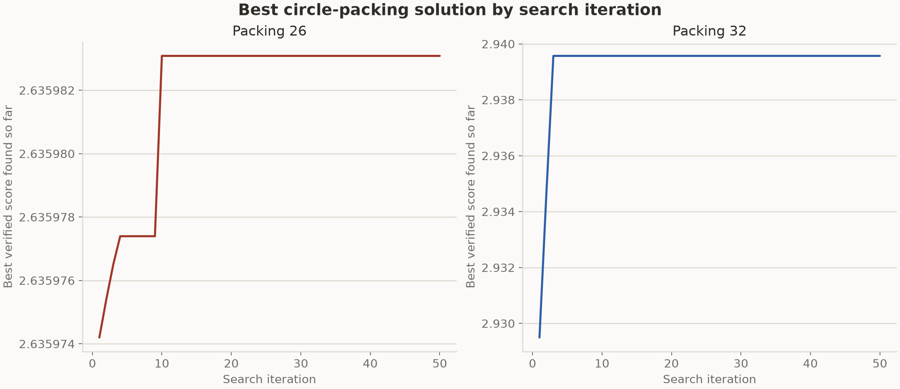
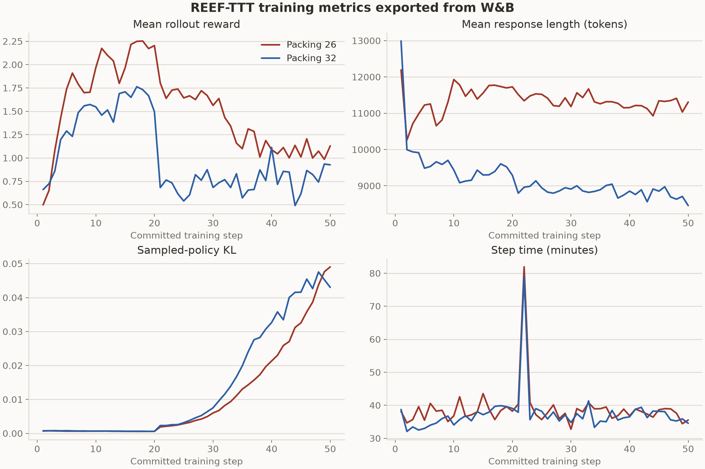

# Circle-packing results from the formal 8x64 run

These two runs used the bundled TTT-Discover harness and the circle-packing
judges in this repository. Each run completed 50 search and training steps with
Qwen3-8B. The search generated eight groups of 64 programs at each step. Reef
trained a rank-32 LoRA adapter after every complete grid and served the updated
adapter during the next search step.

The individual result pages use the same layout as the Erdős result page:

- [Packing 26](packing26/README.md)
- [Packing 32](packing32/README.md)

## Results

Higher values are better. The TTT-Discover column reproduces the six decimal
places reported in the paper's circle-packing table. The target comes from the
task instruction and is not a proven optimum.

| Task | Completed steps | Certified sum of radii | TTT-Discover | Target | Gap to target |
| --- | ---: | ---: | ---: | ---: | ---: |
| Packing 26 | 50/50 | `2.6359830849177777` | `2.635983` | `2.636` | `0.0000169150822223` |
| Packing 32 | 50/50 | `2.9395727712074926` | `2.939572` | `2.940` | `0.0004272287925074` |

Both certified values are within `8e-7` of the values reported by TTT-Discover.
This comparison does not establish a global optimum.



## Best solution by iteration

The curve shows the best-solution history for each run.



## Run configuration

| Setting | Value |
| --- | --- |
| Model | `Qwen/Qwen3-8B`, thinking enabled |
| Hardware | `2 x NVIDIA B200` |
| Search grid | 8 groups x 64 rollouts |
| Training steps | 50 |
| Maximum new tokens | 26,000 |
| Sequence length | 32,768 |
| Sampling | temperature 1.0, top-p 1.0 |
| Optimizer | Adam, learning rate `4e-5` |
| Adapter | LoRA rank 32, alpha 32 |
| Program timeout | 530 seconds |

The jobs used checkpoints to continue the same scenario across scheduler
allocations. The stored search identity fixes the instruction hash, sampling
settings, grid dimensions, model, recipe, and scenario. Reef resumed the same
W&B run ID and continued the monotonic `reef/step` sequence after each restart.

## W&B history

`wandb_history.csv` contains 50 committed rows for each task. The export reads
all local W&B run segments, merges duplicate rows by `reef/step`, and checks
that every step from 1 through 50 is present. `rollout/rewards` is the mean
reward of the training grid at one step. It is not the best score in the search
archive.



The four panels show the mean rollout reward, mean generated response length,
sampled-policy KL, and elapsed time for one committed step. The curves describe
the batches used for training and the time spent waiting for generation and
evaluation. The certified result table comes from the task judge and the saved
search archive.

The mean rollout reward reached its maximum at step 18 for Packing 26 and step
17 for Packing 32. The best-solution history shows that Packing 26 reached its
final certified result at iteration 13. Packing 32 reached
`2.9395727712072386` at iteration 18 and its final result at iteration 24. The
last change was about `2.5e-13`. Sampled-policy KL increased from about
`0.0006` at step 20 to `0.0491` for Packing 26 and `0.0430` for Packing 32 at
step 50.

## Stored files

- `summary.csv` contains the headline values and W&B run IDs.
- `best_solution_history.csv` contains the values used to draw the
  best-solution curves.
- `manifest.json` records the task hashes, runtime commits, scenarios, and jobs
  that produced the milestone summaries.
- `packing26/` and `packing32/` contain the task result page, final generated
  program, best-solution figure, judge summaries at steps 20, 40, and 50, and
  the returned circle coordinates. The checkpoint fields use paths relative to
  the corresponding run root.
- `../export_wandb_history.py` exports the numeric history from local W&B run
  files. It runs in an environment that provides the W&B Python package.

The final programs were executed again to produce `circles.csv`. The replay
used the same boundary and pairwise non-overlap tolerance of `1e-12`. Floating
point summation produced `2.6359830849176467` for Packing 26 and
`2.9395727712062985` for Packing 32. The differences from the saved judge
values are below `1.2e-12`. The table uses the values recorded by the task judge
during the completed runs.

Each task has one search trajectory, so these files do not measure variance
across seeds.

## Regenerate the stored data

Run each saved program in the same Python environment used by the task judge to
recreate its coordinate CSV.

```bash
python ../capture_packing.py packing26/best_solution.py packing26/circles.csv --count 26
python ../capture_packing.py packing32/best_solution.py packing32/circles.csv --count 32
```

The W&B exporter reads local run files. Pass one root directory for each
scenario. That directory must contain all of the scenario's resumed segments.

```bash
python ../export_wandb_history.py \
  --task packing26=/path/to/packing26/wandb \
  --task packing32=/path/to/packing32/wandb \
  --expected-steps 50 \
  --output wandb_history.csv
```
