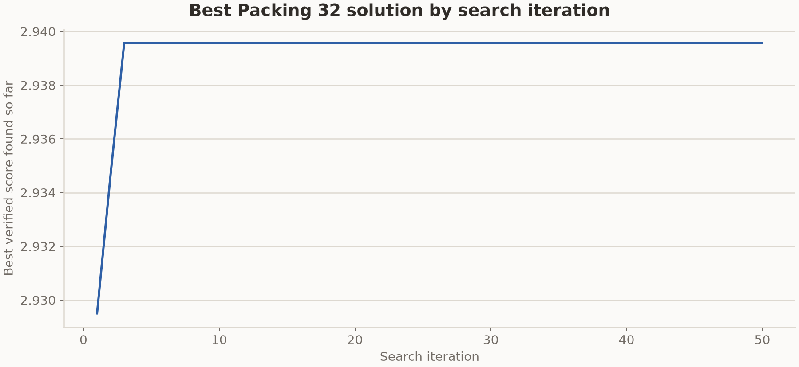

# Packing 32 result from the formal 8x64 run

This run used the bundled TTT-Discover harness and the Packing 32 judge in this
repository. It completed 50 search and training steps. Each step generated
eight groups of 64 programs with Qwen3-8B. Reef trained a rank-32 LoRA adapter
after receiving the complete grid and served the updated adapter during the
next step.

## Result

The judge verifies the circle count, square boundaries, and pairwise
non-overlap before summing the radii. Higher values are better.

| Steps shown | Certified result | TTT-Discover | Target |
| ---: | ---: | ---: | ---: |
| 50 | `2.939573` | `2.939572` | `2.940` |

The two values agree to five decimal places. The target comes from the task
instruction and is not a proven optimum.

## Best solution by iteration

The curve uses the committed PUCT archive after each of the 50 steps. Higher
values are better.

## Run configuration

| Setting | Value |
| --- | --- |
| Model | `Qwen/Qwen3-8B`, thinking enabled |
| Hardware | `2 x NVIDIA B200` |
| Search grid | 8 groups x 64 rollouts |
| Steps shown | 50 |
| Maximum new tokens | 26,000 |
| Sequence length | 32,768 |
| Sampling | temperature 1.0, top-p 1.0 |
| Optimizer | Adam, learning rate `4e-5` |
| Adapter | LoRA rank 32, alpha 32 |
| Evaluation limit | 530-second program timeout |

The run continued across scheduler allocations with the same scenario,
checkpoint, and PUCT archive.

## Run records

W&B stored the training metrics under run
[`030683efe2bfee9866d61cf3b654ef59`](https://wandb.ai/weianxie-massachusetts-institute-of-technology/reef/runs/030683efe2bfee9866d61cf3b654ef59).
The stored state contains one search trajectory, so this result does not
estimate variance across seeds.

## Stored files

- `best_solution.py` is the final generated program selected by the archive.
- `circles.csv` contains the verified circle coordinates and radii.
- `history.jsonl` and the step summaries record the saved result milestones.
- `../best_solution_history.csv` and `../wandb_history.csv` contain the numeric
  histories for both circle-packing runs.
